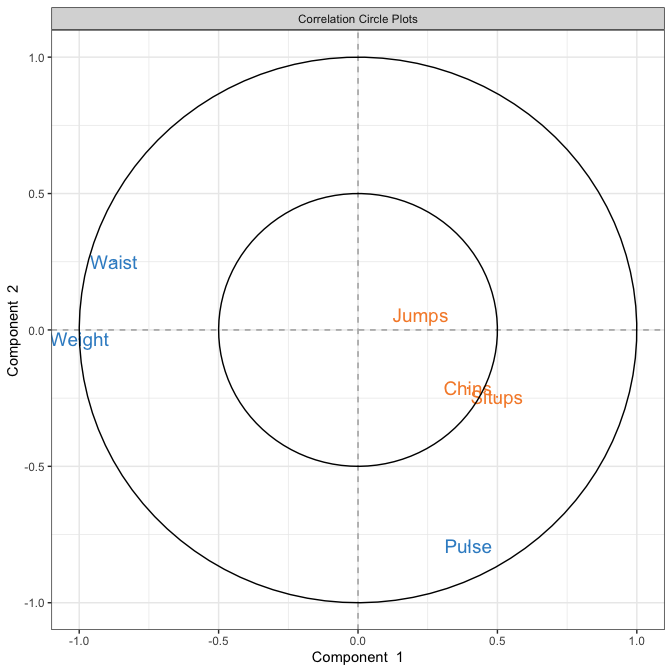
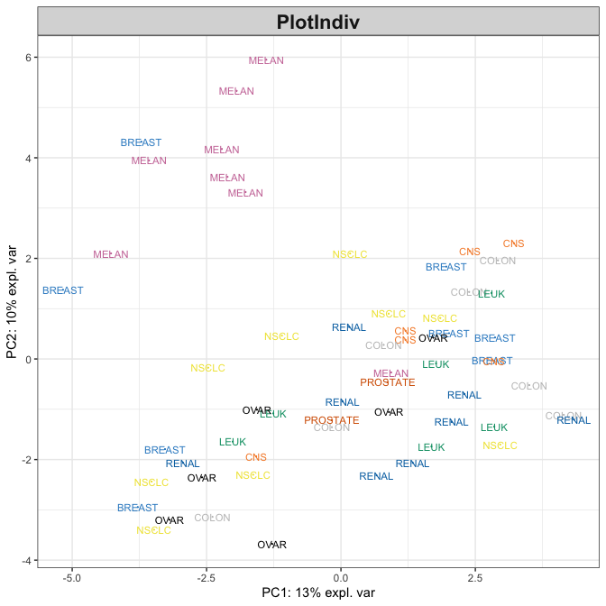

This package is a developing implementation of
[mixOmics](https://github.com/mixOmicsTeam/mixOmics) Bioconductor
package.

The aim is to:

  - implement
    [*roxygen2*](https://cran.r-project.org/web/packages/roxygen2/index.html)
    documentation, and
  - support
    [*MultiAssayExperiment*](http://bioconductor.org/packages/release/bioc/html/MultiAssayExperiment.html)
    datasets.
  - support more intuitve input formats tailored to data integration
    such as `formula` class entry and support of `assay` names.

# Installation:

The package is not complete/tested yet, but feel free to try it using:

``` r
devtools::install_github("ajabadi/mixOmics2")
```

You need to install the data package to be able to run the examples:

``` r
devtools::install_github("ajabadi/mixOmics.data")
```

# News

  - <span style="color:blue"><big>**August 2019**</big></span>: `pls`
    family functions now support `MultiAssayExperiment` and `formula`
    classes as input. [check out example](#pls-mae-formula).
  - <span style="color:blue"><big>**July 2019**</big></span>: `pca`
    family functions now support `MultiAssayExperiment` data. [see
    example](#pca-mae).

### PLS family now supports `MultiAssayExperiment` and `formula` classes

``` r
suppressMessages({library(mixOmics2); library(mixOmics.data)})

## with X and Y as matrices
X <- linnerud$exercise
Y <- linnerud$physiological

pls.res_XY <- pls(X = X, Y = Y)
pls.res_fm <- pls(formula = Y ~ X)
pls.res_fm_MAE <- pls(data = linnerud.mae, formula = physiological~exercise)
## same output for all three
identical(pls.res_XY[-1], pls.res_fm[-1])
```

    ## [1] TRUE

``` r
identical(pls.res_XY[-1], pls.res_fm_MAE[-1])
```

    ## [1] TRUE

``` r
plotVar(pls.res_fm)
```



See `examples/pls.R`, `examples/spls.R`, `examples/splsda.R`,… for more.

### PCA family now supports `MultiAssayExperiment` data

``` r
suppressMessages({library(mixOmics2); library(mixOmics.data)})

## example with MultiAssayExperiment class
pca.res <- pca(X = multidrug.mae, assay = 'ABC.trans', ncomp = 4, scale = TRUE)
plotIndiv(pca.res, ind.names = multidrug$cell.line$Class,
          group = as.numeric(as.factor(multidrug$cell.line$Class)))
```



See `examples/pca.R`, `examples/spca.R`, … for more.
